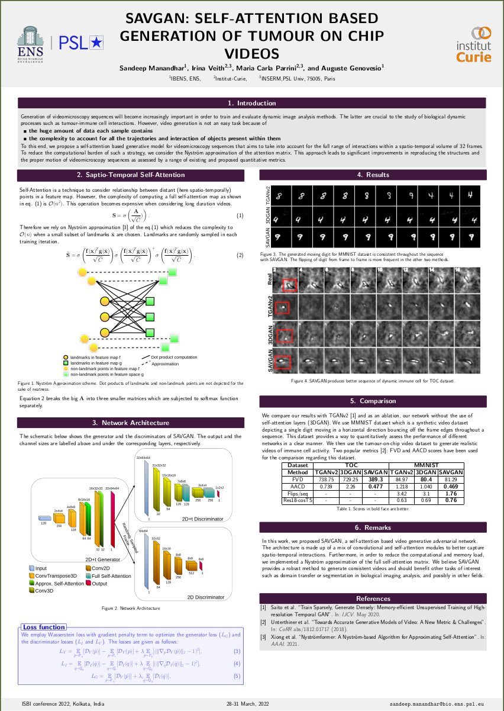

# IBENS-SAVGAN
SAVGAN:-**S**elf **A**ttention based **V**ideo **G**enerative **A**dversarial **N**etwork

This project corresponds to the paper acceted at ISBI 2022 titled [SAVGAN: Self-Attention Based Generation of Tumour on Chip Videos](https://ieeexplore.ieee.org/document/9761518).
The work contributes by making use of Nystrom-based approximation of 3D self-attention matrix. This greatly reduces the complexity of computing the Self-Attention matrix for huge feature maps often encountered when performing 3D CNN in context of video processing.

We are able to generate videos of "Tumour-on-Chip" data where we can see T-cells interacting with Cancer cells.
Additionally, we use animated single digit MNIST (MMNIST') dataset for evaluation. We method performs much better compared to TGAN2.

A video presentation can be found [here](https://youtu.be/4D8N-qr9WSA).

